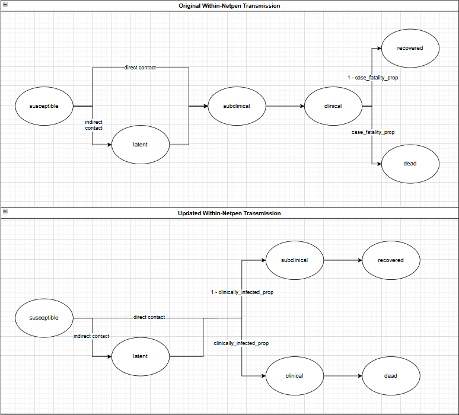

# hydroepixR

<!-- badges: start -->

<!-- badges: end -->

## Disclaimer
The hydroepixr model is for use by professionals trained in aquatic animal health (e.g., veterinarians and fish health managers) and provides information to assist decision-making related to waterborne spread of fish pathogens. While every effort is taken to ensure soundness of model results, model outputs will depend on parameter values selected by users and whether they correctly reflect management practices and mitigations used on fish farms. The model does not provide predictions of events. By using this tool, the user agrees that the authors cannot be held responsible for decisions made based on any information generated by the model.

Note that this package is distributed under the GNU GPLv3. This stipulates that no closed versions of this package may be distributed, regardless of modifications made to the code. For additional details on the GNU GPLv3 license, enter `packageDescription(\"hydroepixr\")$License` in the console.

# Model Introduction
## What is `hydroepixr`?
The hydroepixr model is for use by professionals trained in aquatic animal health (e.g., veterinarians and fish health managers) and provides information to assist decision-making related to waterborne spread of fish pathogens. The package is currently in its beta version, meaning there may still be bugs. There will likely be significant feature additions as development progresses. Bug fix and feature requests can be submitted on the 

## Naming conventions and model structure
For clarity, there are some key terms to know moving forward. The **model** refers to the running of all of `hydroepixr`, through the `he_run_model` function. Each model run can then include multiple **simulations**. Each of these simulations uses the same input parameters, but the stochastic elements may be different and so each simulation may have different results. This models the randomness observed in the real world. Each simulation runs over multiple days, with the infection status of animals and net pens being updated each day.

## The difference between `hydroepix` and `hydroepixr`
You may be familiar with the code on which `hydroepixr` is based, which was called `hydroepix`. The main difference is the conversion to an R package. This involved major restructuring of the code, documentation of functions, and the addition of a test suite. It also simplifies the installation of the package and streamlines it for users. This means that the test files and functions that help "under the hood" are not accessible through default installation. Since this guided exercise aims to simulate the experience of an standard package users, standard installation procedure is followed. However, if you would like to dig deeper into the test suite, all of the functions, and any other files, they are available for you to view on the [`hydroepixr` GitHub](https://github.com/hydroepix/hydroepixr/tree/alpha). It is recommended to complete this guided exercise before looking at the GitHub, to familiarize yourself with the basic model running process.

There has also been a change to the SEIR model used to track within net pen infection at the level of individual animals. Animals previously progressed through the infection stages as follows: susceptible, latent, subclinical, clinical, then either dead or recovered based on a user-defined case fatality proportion. Now, animals exiting the latent stage will become either subclinically or clinically infected according to a user-defined clinically infected proportion, and then recover or die, respectively. This is referred to as the **subclinical-clinical split** See Figure 1 below for a visual depiction of this change.

